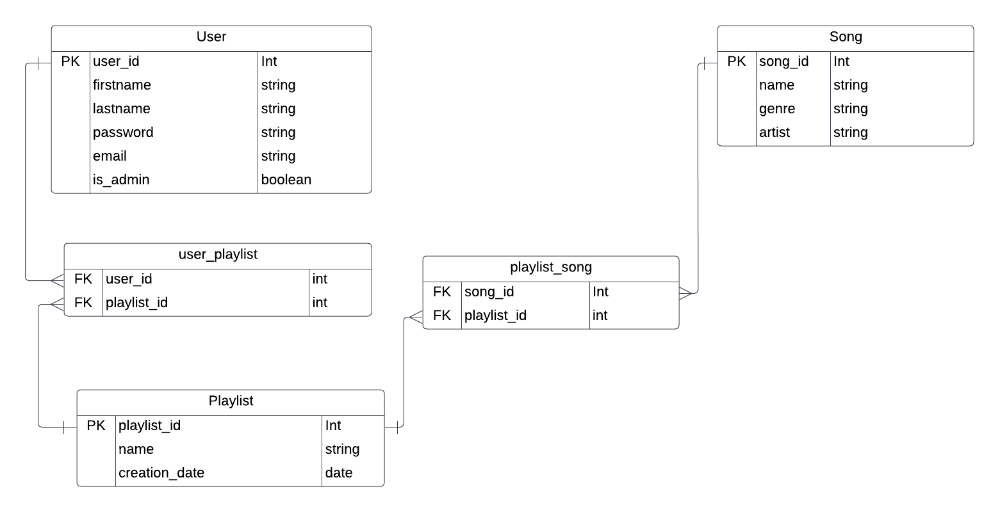
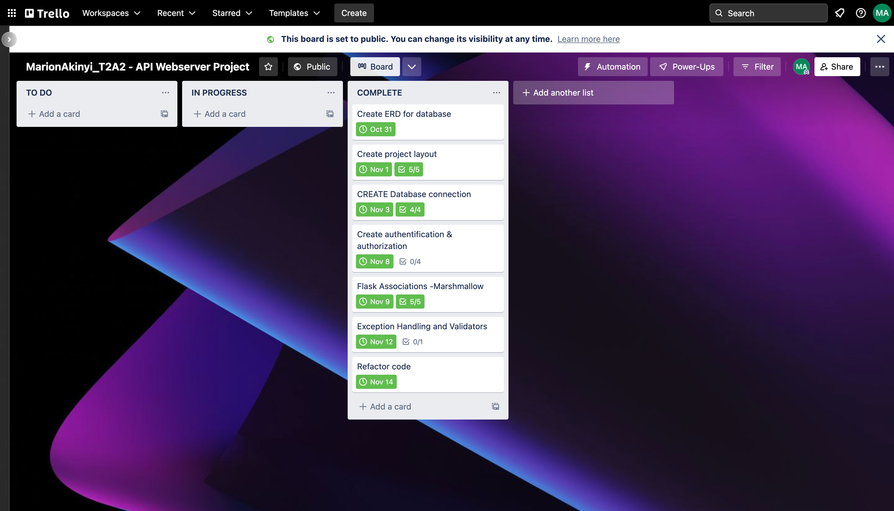

# Music Playlist Api

github link
<https://github.com/marie-debug/music_playlist_API>

## Identification of the problem you are trying to solve by building this particular app

Music is a big part of society as it appears to contribute to our wellbeing. One problem that can be solved by creating a music playlist application is to solve the problem of not having a central place to store ,organize  music and to keep track of the songs one  listens to.

## Why is it a problem that needs solving?

As someone who is an avid music listener , this is a problem that needs solving because:

1. It can be difficult to find specific songs you want to listen to.i.e if there is no reference to a particular song one tends to forget eg the name etc so it would be great to have a reference point to have.
2. It can be difficult to keep track of which songs you have and have not listened to: a music playlist application is a great way to stay up to date with new releases from your favorite artist as well as look back through time to older music releases that one loved.
3. It can be difficult to remember where you downloaded or saved certain songs:
4. Sometimes we download music to our devices and oftentimes we forget which files or folders we downloaded the music to. Having a database not only makes it more convenient but it also makes it efficient.
5. If you have a large collection of music, it can be difficult to keep it all organized.
6. Having a music playlist not only makes you a good curator as you get to organize music into a collection of some kind depending on e.g. the mood or emotion you want eg study, happy hits etc

## Why have you chosen this database system? What are the drawbacks compared to others?

I have chosen to use postgresql also known as PSQL because: i find it is easy to learn,   it is free to use and open source  and  it also allows me to define inheritance relationships between tables in this application that is relationships between users, playlists and songs . PSQL supports JSON data which is an ideal data-interchange language.Moreover Postgresql  has been around for a while and so troubleshooting with this database is easy as there is a huge community base. Lastly PSQL maintains referential integrity by the use of foreign keys this helps to prevent records from being added, deleted or modified. I find this very useful especially in this project where different tables depend on each other.

### Drawbacks and benefits compared to other databases

#### Cassandra

- Cassandra is a better choice when you need scalability and high availability without compromising performance. In general, Cassandra is more scalable and offers better performance than PostgreSQL.
- PostgreSQL is a relational database, while Cassandra is a NoSQL database. This means that Cassandra is more flexible in terms of data model design, but PostgreSQL offers more powerful query capabilities.
- Cassandra is designed for horizontal scalability, while PostgreSQL is designed for vertical scalability. This means that Cassandra can handle more data and more concurrent users than PostgreSQL, but PostgreSQL can offer better performance for individual queries.
- Cassandra offers stronger consistency guarantees than PostgreSQL. This means that Cassandra is better suited for applications that require strict data consistency, while PostgreSQL may be more suitable for applications that can tolerate some degree of data inconsistency.

#### Mongo

- PostgreSQL is a relational database, while MongoDB is a document-oriented database. This means that PostgreSQL stores data in tables and rows, while MongoDB stores data in documents and collections.
- PostgreSQL is ACID compliant, while MongoDB is not. This means that PostgreSQL supports transactions and maintains data integrity, while MongoDB does not.
- PostgreSQL has a richer set of features and data types than MongoDB. For example, PostgreSQL supports user-defined types and functions, while MongoDB does not.
- PostgreSQL is more mature and stable than MongoDB. PostgreSQL has been around since 1986, while MongoDB was first released in 2009. In general, PostgreSQL is a better choice for applications that require a relational database, while MongoDB is a better choice for applications that require a document-oriented database.

#### MySQL

- The benefits of PostgreSQL over MySQL are that PostgreSQL has a more robust feature set and is more scalable. PostgreSQL is also more resistant to SQL injection attacks. However, MySQL is more widely used and has better performance on smaller scale projects.
- Postgresql is more flexible than mysql because it supports both relational and object-oriented data models. This means that postgresql can store data in both tabular and object-oriented form. On the other hand, mysql only supports the relational model. This makes postgresql more suitable for applications that require both types of data.
- Another difference between postgresql and mysql is that postgresql is more scalable than mysql. This is because postgresql supports both horizontal and vertical scaling. Horizontal scaling means that postgresql can be used on multiple servers. Vertical scaling means that postgresql can be used on a single server with multiple processors.
- Postgresql is also more secure than mysql. This is because postgresql uses a different authentication method than mysql. Postgresql uses a password-based authentication method while mysql uses a cookie-based authentication method.

## Identify and discuss the key functionalities and benefits of an ORM

ORM (Object Relational Mapping) is a tool that allows developers to work with databases using objects, rather than database-specific code.This means that developers can write code that is more portable and easier to maintain. Additionally, ORMs can provide a number of other benefits, such as

The main benefits of using an ORM are:

- Increased productivity -There are many ways in which ORM can increase productivity.One way is by providing a way to quickly and easily map objects to database tables. This can save a lot of time and effort when working with large data sets. Additionally, ORM can provide a way to easily query data and retrieve results. This can again save a lot of time and effort when working with large data sets. ORM can provide a way to easily and automatically generate code. This can save a lot of time and effort when working with large data sets. In summary  ORMs can automate many of the tedious and error-prone tasks of data conversion, such as creating and maintaining class definitions, writing conversion code, and dealing with type mismatches.
- Reduced maintenance costs -ORM can help reduce maintenance costs by automating and simplifying repetitive tasks, such as data entry and report generation. Additionally, ORM can provide a central repository for data that can be accessed by multiple users, which can help reduce the need for manual data entry and ensure data accuracy. Once an ORM solution is in place, it can be used over and over again for different projects with little or no modification.
- Improved data quality \- ORM can improve the quality of converted data by providing a consistent, well-defined mapping between source and target data structures.Additionally ORM can help to ensure that data is entered consistently and accurately, by providing clear guidelines and rules for data entry.They help to identify and correct errors in data, by providing tools for checking data accuracy and completeness and  can help to improve the quality of data by providing tools for cleansing and enriching data. They also  ensure that data is used consistently and accurately, by providing clear guidelines and rules for data access and manipulation. Finally they  help to ensure that data is managed effectively, by providing tools for managing data resources and metadata.
- Greater flexibility \- ORM can be used to map between any two incompatible type systems, regardless of whether they are based on the same or different technologies. Compared to SQL ,ORM can be used to map objects to database tables in a much more flexible way than SQL eg:

- ORM can be used to map a single object to multiple database tables, or to map multiple objects to a single database table.
- ORM can be used to map an object to a database table that does not have a one-to-one correspondence with the object's properties.
- ORM can be used to map an object to a database table that is not necessarily defined by the object's class.
- ORM can be used to map an object to a database table that is not necessarily located in the same database as the object.

## An ERD for your app

## Detail any third party services that your app will use

Postgresql: PostgreSQL is a powerful, open source relational database system. It has a strong reputation for reliability, feature robustness, and performance.I  have Used it as the main database for the application. The application stores data in the database and retrieves data from the database as needed.

Marshmallow: Marshmallow is a Python library for serializing objects. It can be used in Flask applications to serialize objects to and from JSON. In this app I have used it to validate data through the schema and deserialize data.

Flask_sqlalchemy:  Flask-SQLAlchemy is an extension for Flask that adds support for SQLAlchemy to your application by providing a powerful ORM . It aims to simplify using SQLAlchemy with Flask by providing useful defaults and extra helpers that make it easier to accomplish common tasks. In this app i have used it to define models and access database data and perform common database operations such as deleting ,creating and updating through its session class

Flask_jwt_extended:Flask-JWT-Extended is an open source project that aims to make working with JSON Web Tokens in Flask applications as simple as possible.In this app i have used the jwt_required() decorator to specify that a view function can only be accessed by a user with a valid JWT and to simply specify a secret key and use the create_access_token() and get_jwt_identity() functions to create and verify JWTs, respectively.

flask_marshmallow:Flask-Marshmallow is a library for simplifying the process of serializing Python objects to and from JSON. In  this application I have used it to automatically serialize and deserialize objects to and from JSON as well as create schemas based on my models.

Flask_bcrypt:Flask_bcrypt is a flask extension that provides bcrypt hashing utilities for flask applications. It can be used to hash passwords, encrypt data, and generate secure tokens. It does this by generating a random salt value and then hashing the password with the salt. In this application it has been used to hash user passwords when they register. Flask-Bcrypt provides a number of functions and utilities that make it easy to hash passwords and to check if a given password matches a hash. For example, in this app I have  used the generate_password_hash() function to hash a password, and then use the check_password_hash() function to check if a given password matches the hash.

## Describe your projects models in terms of the relationships they have with each other

The models in this project  are:

1. User model: The user model contains information about the user that is the user name, password, email as well as playlists.The user model is related to playlist model which stores the users playlist.
2. Playlist model: The playlist model represents a collection of songs  containing information about each playlist with attributes such as  the name of the playlist, the creator of the playlist, the date it was created, and a list of songs that are in the playlist.Users can create their own playlists and add, remove songs in the playlist .
3. Song model: The song  model represents a single song it  contains information about each individual song, such as the name of the song, the artist , the genre it belongs to, and the playlist it belongs to.The song  model is related to the playlist model which stores the songs in the playlist.A song can be added to a playlist, and a playlist can contain multiple songs.

## Discuss the database relations to be implemented in your application

- The relation between the songs and the playlist. This relation is many-to-many, because a playlist can have many songs and a  song can  be in many playlists.
- The relation between the user and the playlist. This relation is also many-to-many, because a user can have many playlists and also  a playlist can only have one user.

## Describe the way tasks are allocated and tracked in your project

Tasks are allocated and tracked through Trello. I used  Trello to keep track of all the tasks that needed  to be completed for the  project. I started out with a to-do list  with appropriate tasks. Each feature is assigned to a specific card with a checklist of the process of implementing code and a date of completion. When working on a task the card is moved to in progress and finally when the task is complete it is moved to completed.

<https://trello.com/b/Q73dkvh4/marionakinyit2a2-api-webserver-project>

## Api Documentation

### POST register

<http://127.0.0.1:8080/auth/register>

BODY

{

"firstname": "tom",

"lastname": "tom",

"email": "tom@email.com",

"password": "foo123"

}

### POST login

<http://127.0.0.1:8080/auth/login>

BODY

{

"password": "foobar231",

"email":"admin@spam.com"

}

### GET users

<http://127.0.0.1:8080/auth/users>

AUTHORIZATION

Requires Bearer Token

### GET get playlists

<http://127.0.0.1:8080/playlists>

AUTHORIZATION

Requires Bearer Token

### POST create song

<http://127.0.0.1:8080/playlists/2/songs>

AUTHORIZATION

Requires Bearer Token

BODY

{

"name": "wolf",

"genre": "rock",

"artist": "wolf rock"

}

### POST create playlist

<http://127.0.0.1:8080/playlists>

AUTHORIZATION

Requires Bearer Token

BODY

{

"name":"rock_songs"

}

### GET get playlist

<http://127.0.0.1:8080/playlists/1>

AUTHORIZATION

Requires Bearer Token

### PUT update playlist

<http://127.0.0.1:8080/playlists/2>

AUTHORIZATION

Requires Bearer Token

BODY

{

"name":"dogs"

}

### DEL delete playlist

[http://127.0.0.1:8080/playlists/1](https://www.google.com/url?q=http://127.0.0.1:8080/playlists/1&sa=D&source=editors&ust=1668343287354917&usg=AOvVaw273uGE6Tfcqnn6ZPjQWXgW)

AUTHORIZATION

Requires Bearer Token

### DEL delete song

[http://127.0.0.1:8080/playlists/4/songs/5](https://www.google.com/url?q=http://127.0.0.1:8080/playlists/4/songs/5&sa=D&source=editors&ust=1668343287355778&usg=AOvVaw2Fg7vtJPjcNTFtGgLFc_lF)

AUTHORIZATION

Requires Bearer Token
